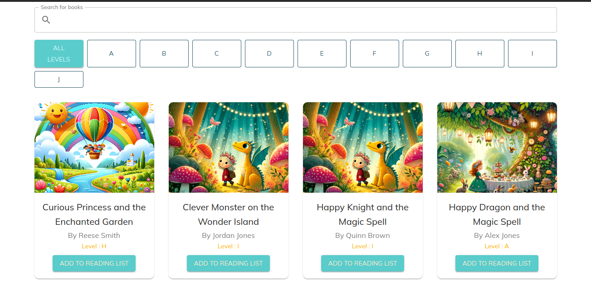
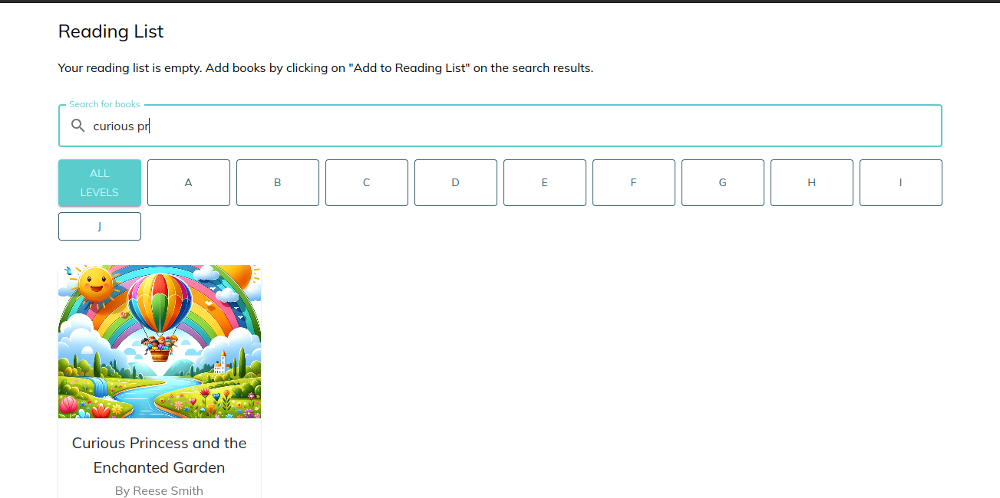
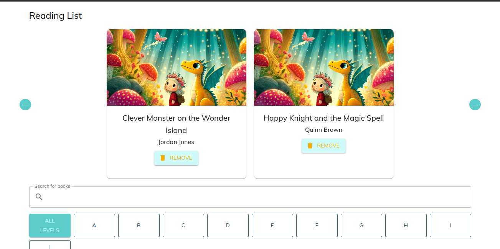

# Elimu

## Overview

This project is a web application designed to help teachers manage their students' reading lists. The application consists of a frontend and a backend, both of which require Node.js version 18.18 or later to run.

## Features

### Frontend

The frontend of the application is built with React and Material UI. It includes the following features:

- **Search Bar**: Allows users to search for books by title.
- **Search Results**: Displays a list of search results, including the book title, author, and a button to add the book to the student's reading list.
- **Reading List**: Displays all the books that the teacher has added.
- **Remove Button**: Allows users to remove a book from the reading list.

### Backend

The backend of the application handles the logic for managing the books and reading lists. 

## Installation

### Prerequisites

- Node.js version 18.18 or later

### Frontend

1. Navigate to the frontend directory:
    ```sh
    cd frontend
    ```
2. Install the dependencies:
    ```sh
    npm install
    ```
3. Start the frontend server:
    ```sh
    npm run start
    ```

### Backend

1. Navigate to the backend directory:
    ```sh
    cd backend
    ```
2. Install the dependencies:
    ```sh
    npm install
    ```
3. Start the backend server:
    ```sh
    npm run start
    ```

## Screenshots

### Home Page



### Search Results



### Reading List



## Technologies Used

- **Frontend**: React, Material UI
- **Backend**: Node.js


